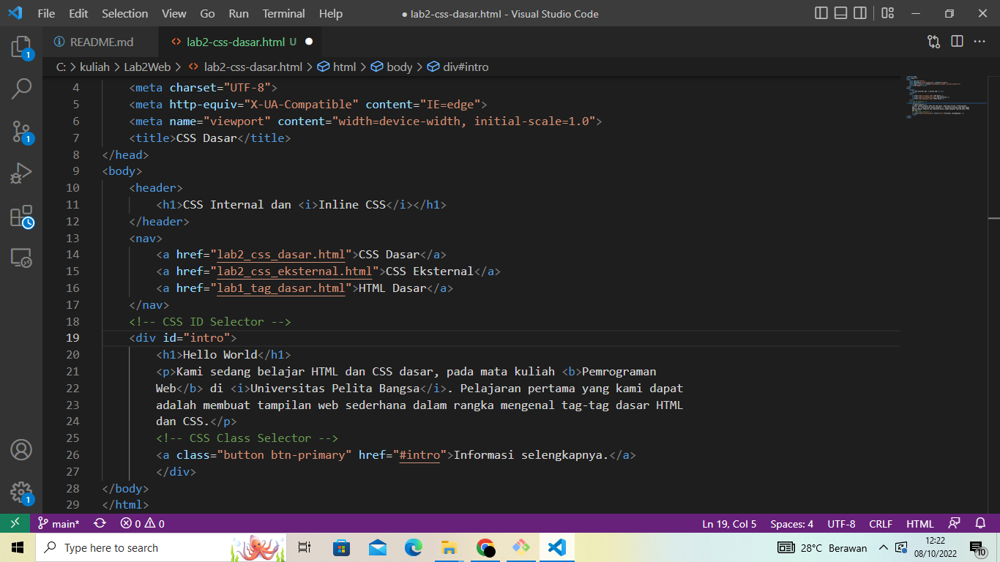
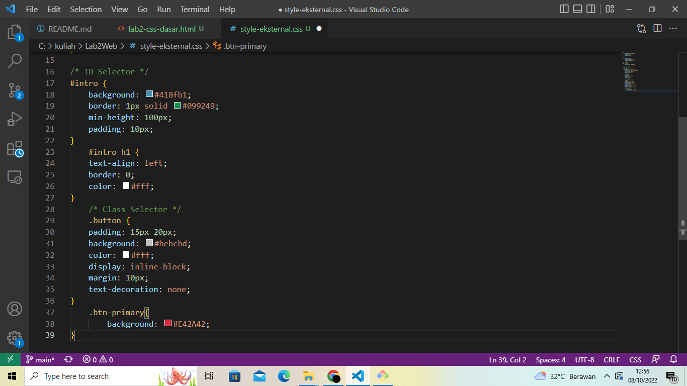

# Lab2Web

# TUGAS 2
| Nama | kelas | Nim | Matkul |
| -- | --- | ---- | ----------- |
| Heri Anto Simamora | TI.21.B.2| 312110365 | Perograman Web |

## MEMBUAT DOKUMEN HTML

## MENDEKLERASIKAN CSS INTERNAL

## MENAMBAHKAN INLINE CSS

## MEMBUAT CSS EKSTERNAL 

## MENAMBAHKAN CSS SELECTOR

## SOAL 

## JAWABAN 

- 

- perbedaan pendeklarasian h1 dengan #intro h1 hanya pada #intro (properti Id )yaitu berfungsi memanggil selector dari #intro agar tampilah h1 mengikuti dengan #intro. contoh h1 tanpa #intro 

- deklarasi eksternal karena Salah satu cara yang paling nyaman untuk menambahkan CSS ke website dengan menghubungkannya ke file .CSS eksternal. Dengan cara tersebut, perubahan apapun yang Anda buat pada file CSS akan tampil pada website Anda secara keseluruhan 

- deklarasi id karena id berfungsi untuk memanggil selector dari properti yang lain 
